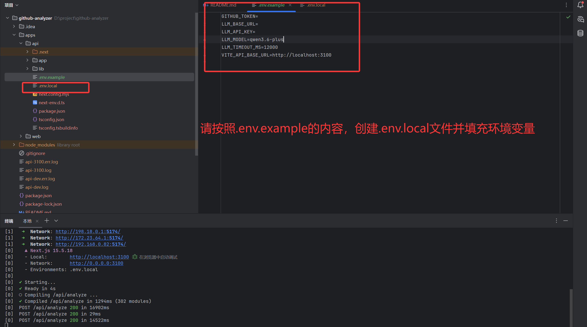
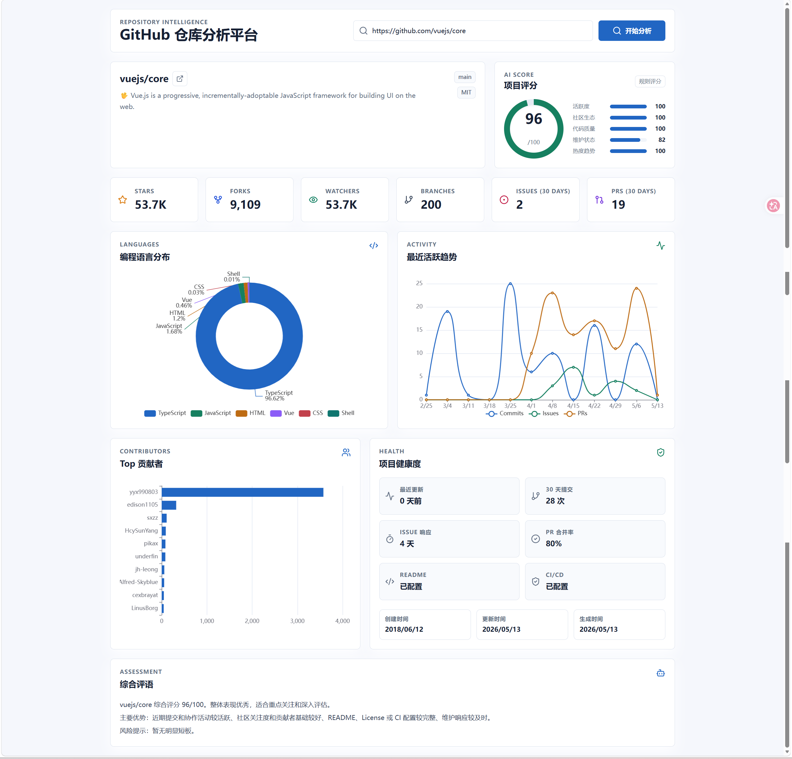

# GitHub 仓库分析可视化平台

本项目包含一个 Next.js API 后端和一个 Vue 3 + Vite 前端，用于分析公开 GitHub 仓库并展示可视化指标、健康度和 AI 项目评分。

## 本地运行

```bash
npm install
npm run dev
```

默认端口：

- API: http://localhost:3100
- Web: http://localhost:5174

请复制 `.env.example` 为 `.env.local`（配置文件在项目的apps/api路径下） 或在系统环境中设置：

- `GITHUB_TOKEN`: GitHub Personal Access Token，用于提升 API 限流额度
- `LLM_BASE_URL`: OpenAI-compatible 本地 LLM 地址
- `LLM_MODEL`: 默认 `qwen3.6-plus`
- `LLM_API_KEY`: 如本地 LLM 需要鉴权则填写
- `VITE_API_BASE_URL`: 前端直连 API 地址，默认 `http://localhost:3100`

未配置本地 LLM 或调用失败时，后端会自动使用规则评分降级，保证演示可用。

## 常用命令

```bash
npm run dev
npm run build
npm run typecheck
```

## API

`GET /api/health`

返回 API 服务健康状态。

`POST /api/analyze`

```json
{
  "url": "https://github.com/vuejs/core"
}
```

返回仓库基础信息、指标、语言分布、贡献者排行、活跃趋势、健康度和评分结果。


### SSE 评语端点

`GET /api/score-comment?url=https://github.com/vuejs/core`

流式返回 AI 评语。返回格式为 `text/event-stream`，逐块推送评语内容。

```bash
curl "http://localhost:3100/api/score-comment?url=https://github.com/vuejs/core"
```

错误时返回 `[ERROR]` 标记，前端会自动降级到规则评分。

未配置 LLM 或调用失败时，自动使用规则评分降级。